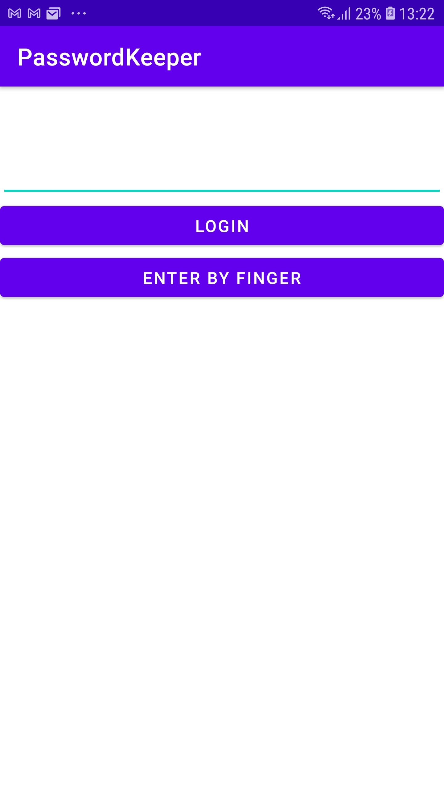
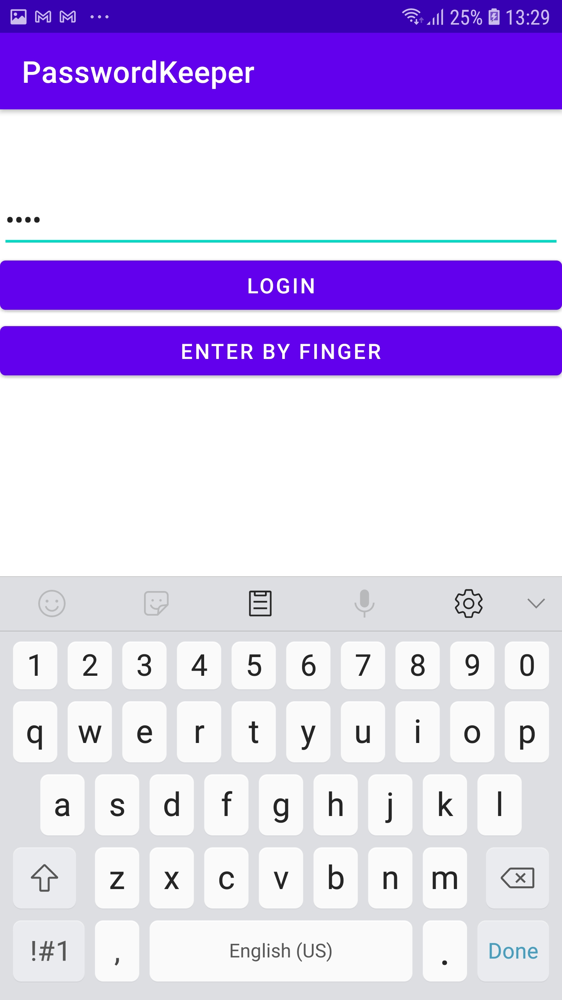
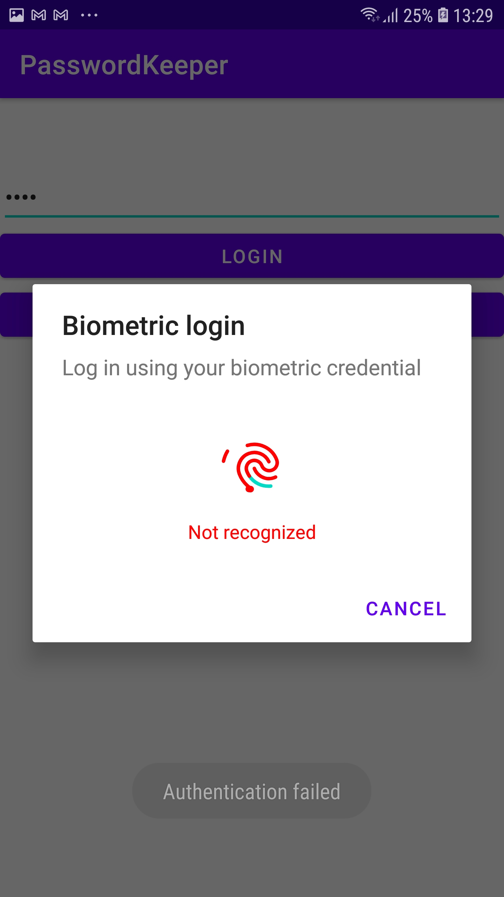
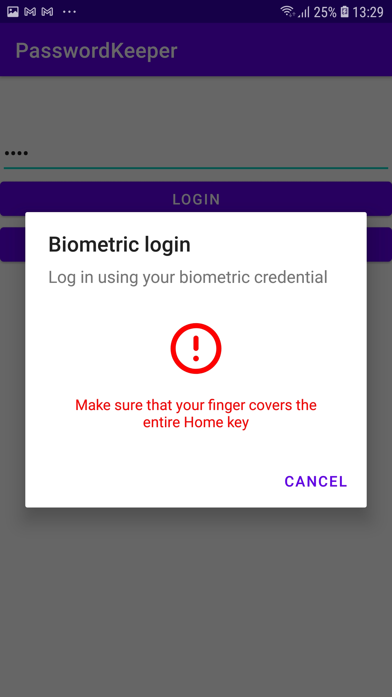
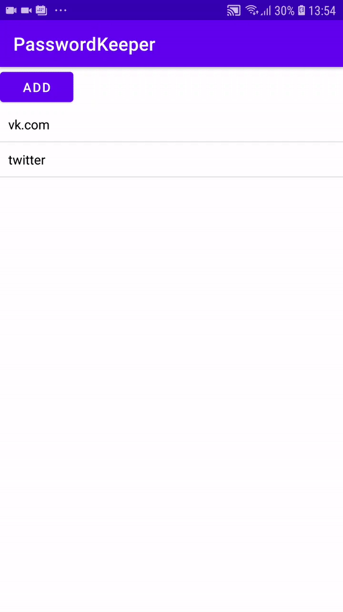
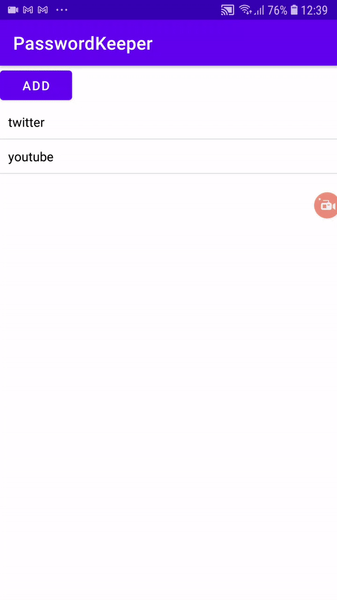
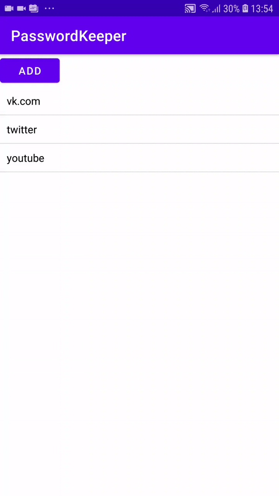

# PasswordKeeper Samolazov Herman 

Приложение для генерации и хранения пароль для аккаунтов.

Функциональные возможности: создание аккаунта(логин, пароль, описание), генерация надежного пароля, удаление и редактированию аккаунта.

Для защиты данных используется SQLCipher, запрет на скриншоты и съемку видео и биометрическая аутентификация в формате входа по пальцу(еcли на устройстве нет сканера отпечка пальца, то используется текстовый пароль).

Логин:

 

Добавление аккаунта и генерация пароля (**гифка показывается циклично, поэтому кажется, что аккаунт пропадает**): 

 

 При просмотре аккаунта имеется возможность копировать значения путем тапа по определенному полю:
 
  

Редактирование аккаунта:

 

Удаление аккаунта:

 
